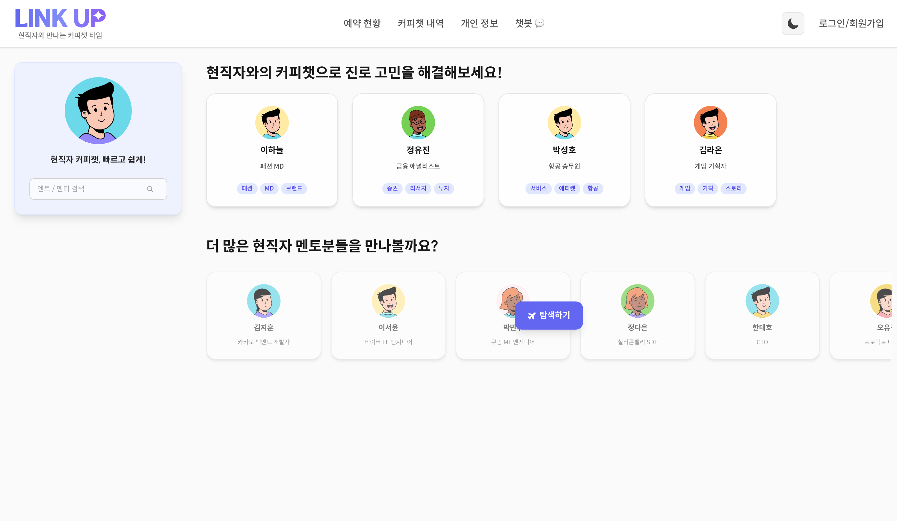

# 🔗 Link Up


> 고등학생과 현직자를 연결하는 커피챗 매칭 플랫폼

## 📌 소개

2025 아주대학교 AMiCoM 해커톤 프로젝트로, 진로 고민을 가진 고등학생과 현직자를 매칭하여 부담 없는 커피챗을 통해 실무 경험과 조언을 나눌 수 있는 웹 플랫폼입니다.



## ✨ 주요 기능

### 멘티 (고등학생)

- 다양한 분야 현직자 멘토 탐색 및 검색
- 관심 분야별 필터링
- 커피챗 예약 신청 및 관리

### 멘토 (현직자)

- 진로 고민 학생 프로필 탐색
- 커피챗 요청 수락/거절
- 예약 일정 관리

## 🛠 기술 스택

- **Frontend**: React, TypeScript, Vite
- **Styling**: TailwindCSS, Framer Motion
- **State**: Zustand, Tanstack Query
- **Routing**: React Router DOM
- **UI**: React Nice Avatar, React Icons

## 🚀 시작하기

```bash
# 설치
npm install

# 개발 서버
npm run dev

# 빌드
npm run build
```

## 📱 주요 페이지

| 페이지        | 설명                             |
| ------------- | -------------------------------- |
| **메인화면**  | 멘토/멘티 추천, 검색, 예약 알림  |
| **탐색하기**  | 전체 멘토/멘티 탐색 및 필터링    |
| **회원가입**  | 회원가입 및 역할 선택            |
| **예약 현황** | 커피챗 예약 현황 관리(수락/거절) |

## 🍀 기대 효과

### 학생 측면

- **실무 진로 탐색**: 교과서가 아닌 실제 현장 경험을 통한 생생한 진로 정보 습득
- **부담 없는 소통**: 가벼운 커피챗 형식으로 편안하게 궁금증 해결
- **다양한 직군 탐색**: 여러 분야 현직자들과의 만남으로 진로 선택의 폭 확대

### 교육 기관 측면

- **교사 업무 경감**: 진로 지도 부담 감소 및 전문적인 멘토링 지원
- **교육 정책 지원**: 고교학점제, 자유학기제 등 진로 중심 교육과정 보완

### 사회적 측면

- **세대 간 소통**: 청소년과 현직자 간 자연스러운 교류 문화 형성
- **직업 만족도 향상**: 실무 정보 기반 진로 선택으로 대학 전공 및 직업 선택 만족도 향상
- **지역 격차 해소**: 온라인 플랫폼을 통한 지역 불균형 완화
